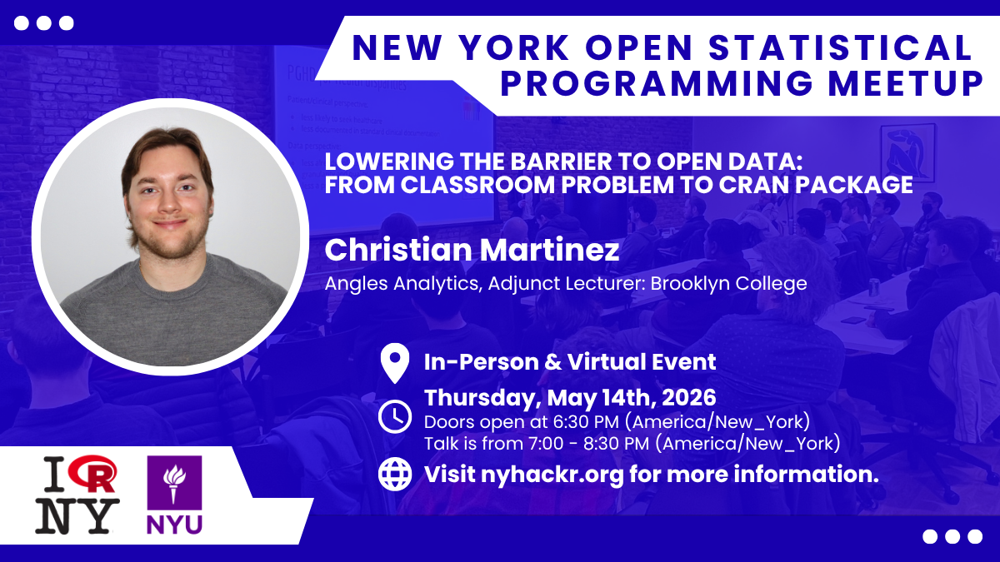
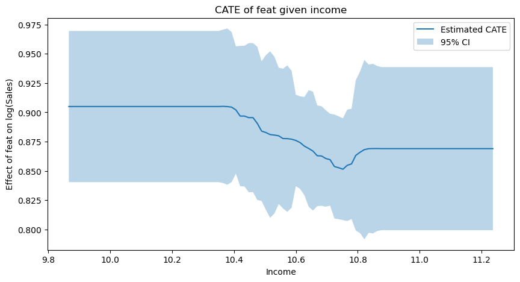
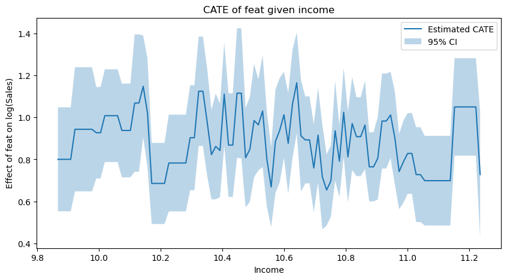
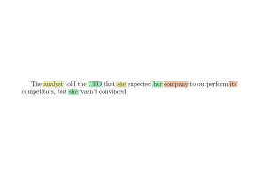
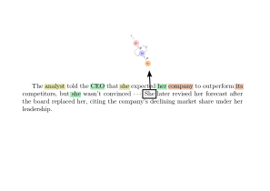

## Week Summary

- Optional Lab 8
- Presentations!
- Pretrained Models: Different Reading
- Coding Vignette Posted (without video)


## nyhackr Thursday May 14th!




## Lab Comments

1. No ridge regression without using the standard scaler!!!
2. Pick CausalML Hyperparameters to Make things Smooth

```{python}
#| echo: true
#| eval: false
est = CausalForestDML(
    model_y=LassoCV(cv=3),
    model_t=LogisticRegressionCV(cv=3),
    n_estimators=8000,
    min_samples_leaf=50,
    #max_depth=5,
    max_samples=0.02,
    discrete_treatment=True,
    random_state=123
)


```


## Lab Comments

1. No ridge regression without using the standard scaler!!!
2. Pick CausalML Hyperparameters to Make things Smooth




## Lab Comments


1. No ridge regression without using the standard scaler!!!
2. Aggressive Choices Lead to Aggressive Fits

```{python}
#| echo: true
#| eval: false

est = CausalForestDML(
    model_y=LassoCV(cv=3),
    model_t=LogisticRegressionCV(cv=3),
    n_estimators=8000,
    min_samples_leaf=10,
    max_depth=40,
    max_samples=0.45,
    discrete_treatment=True,
    random_state=123
)

```


## Lab Comments


1. No ridge regression without using the standard scaler!!!
2. Aggressive Choices Lead to Aggressive Fits




## Contextual Meaning

- Consider an LSTM Processing this Text

::: {.absolute bottom=0}

:::


## Contextual Meaning

- Pronouns embedded as vectors, but mean specific things

::: {.absolute bottom=0}

:::


## Contextual Meaning

- LSTM incorporates their meaning via long-range states

::: {.absolute bottom=0}

:::


## Contextual Meaning

- Later, same pronouns may occur

::: {.absolute bottom=0}

:::


## Contextual Meaning

- LSTM's understanding too compressed to remember previous context

::: {.absolute bottom=0}

:::


## Attention


## Transformer Architecture


## Encoder Models: BERT


## Decoder Models:


## Fine Tuning Large Models


